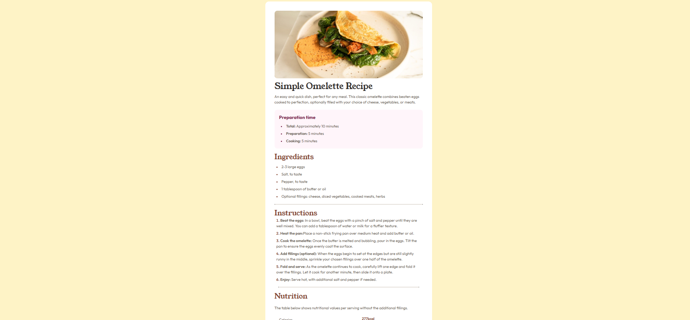

# Frontend Mentor – Recipe Page Solution

This repository contains my solution to the [Recipe page challenge on Frontend Mentor](https://www.frontendmentor.io/challenges/recipe-page-KiTsR8QQKm). The goal of this challenge was to build a responsive recipe layout using clean HTML structure and modern CSS practices.

## Overview

This project focuses on creating a simple, elegant recipe page that adapts smoothly across different screen sizes. It emphasizes semantic HTML, mobile-first design, and utility-first styling with Tailwind CSS.

### Screenshot

### Links

- **Solution URL:** 
- **Live Site URL:** 

## My Process

### Built With

- Semantic HTML5
- Tailwind CSS
- Flexbox
- Mobile-first workflow

### What I Learned

- Building fully responsive layouts efficiently using Tailwind CSS utilities  
- Writing clean, semantic HTML for better structure and accessibility  
- Structuring layouts in a scalable and maintainable way  

### Continued Development

I plan to continue improving my mastery of Tailwind CSS, focusing on cleaner utility patterns, better spacing systems, and more consistent design decisions across components.

## Author

- **Name:** Al Zehad  
- **Frontend Mentor:** [@al-zehad](https://www.frontendmentor.io/profile/al-zehad)  
- **Facebook:** [Al Zehad](https://facebook.com/alzehad71)
